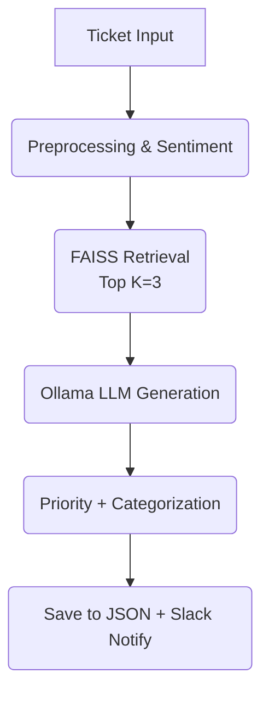

# 🧠 AI Support Assistant Pro
> "Your AI teammate who never sleeps, never complains, and always answers tickets on time!"

[](https://www.python.org/)
[](https://ollama.com)
[](https://streamlit.io)
[](https://opensource.org/licenses/MIT)


---

## 📖 Table of Contents
- [What Is This?](#-what-is-this)
- [Why This Project Exists](#-why-this-project-exists)
- [Features That'll Make You Smile](#-features-thatll-make-you-smile)
- [System Architecture](#-system-architecture)
- [Tech Stack](#-tech-stack)
- [Project Structure](#-project-structure)
- [Setup Guide](#-setup-guide)
- [Usage](#-usage)
- [Knowledge Gap Detection](#-knowledge-gap-detection)
- [Admin Portal](#-admin-portal)
- [Analytics Dashboard](#-analytics-dashboard)
- [Slack Integration](#-slack-integration)
- [Screenshots](#-screenshots)
- [Testing](#-testing)
- [Contributing](#-contributing)
- [License](#-license)
- [Acknowledgments](#-acknowledgments)
- [Project Goals](#-project-goals)
- [Support & Contact](#-support--contact)
- [Final Words](#-final-words)

---

## 🤔 What Is This?

**AI Support Assistant Pro** is a full-stack intelligent ticket intake system that makes support engineers actually look forward to Monday mornings.  *(Okay, maybe not Monday mornings, but definitely fewer "where is that doc?" moments.)*

This system:
- Reads support tickets (subject + description)
- Understands customer emotions (yes, including rage)
- Searches through historical tickets like Sherlock Holmes with a CS degree
- Generates human-quality responses using local LLMs
- Detects knowledge gaps in your KB
- Sends rich alerts to Slack when things go sideways


The best part? It runs entirely on **Ollama** — no cloud costs, no privacy leaks, and no judgment for your messy ticket descriptions.

---

## 💡 Why This Project Exists

This system is built as part of an **AI-Powered Knowledge Engine for Smart Support & Ticket Resolution**.

It targets real-world support problems:
- Slow response times due to manual searching in outdated docs
- Inconsistent answers for similar tickets
- Hidden knowledge gaps that only show up when customers complain
- Lack of proper insights into ticket patterns, sentiment, and bottlenecks

By combining **LLMs**, **semantic search**, and **analytics**, this project turns your support workflow into a smart, continuously learning engine.

---

## ✨ Features That'll Make You Smile

### 🔍 Smart Ticket Understanding
- **Dual Input Processing** Reads both **subject** and **description** for complete context.
- **FAISS-Powered RAG** Uses **sentence-transformers (all-MiniLM-L6-v2)** + **FAISS** to find similar historical tickets.
- **LLM-Generated Responses** Uses local Ollama models (e.g., `llama3.2`, `mistral`) to generate customer-ready replies.
- **Automatic Classification** Assigns:  
  - Priority: `High`, `Medium`, `Low`  
  - Category / type  
  - Topics & tags

---

### 😊 Sentiment & Emotion Detection
- Integrates **TextBlob** (when available) to compute sentiment polarity.
- Converts raw polarity into labels like:  
  - Positive  
  - Neutral  
  - Negative
- Negative sentiment can **boost ticket priority** (because angry users shout loudest).


---

### 🧩 Knowledge Gap Detection

When the AI cannot find good matches in your historical data, it raises a **Knowledge Gap** instead of hallucinating.

Example stored structure:
```json
{
  "flagged": true,
  "gap_reason": "No good retrievals",
  "kb_fill_text": "",
  "filled_by": "",
  "filled_at": null
}
````

Admins can later fill this gap from the **Admin Portal**, and the system:

  - Saves the KB fill text with who filled it and when
  - Reuses this text in **future retrievals** for similar tickets

**Teach once → AI remembers forever.** 🧠

-----

### 🏷️ Intelligent Topic Tagging

The app uses regex-based topic extraction and metadata to detect common topics like:

  - Login Issues
  - Payment Problems
  - Technical Bugs
  - Account Management
  - Feature Requests
  - Refund Requests

These topics show up in both the ticket view and analytics.

-----

### 🌐 Multi-Language Support

  - **Language Detection** via `langdetect` (if installed)
  - Tickets store a `language` field
  - Admin analytics allow filtering by language to see trends per locale

-----

### 🛠️ Admin Portal

A dedicated `admin_app.py` provides an **Admin UI** to:

  - Open / Close tickets
  - Fill knowledge gaps with proper audit trail
  - Re-run LLM generation (where applicable)
  - Filter and search tickets based on:
      - Status
      - Priority
      - Sentiment
      - Text search
      - Date ranges

-----

### 📊 Analytics Dashboard

Because managers love charts more than raw logs:

  - Priority distribution (High / Medium / Low)
  - Sentiment distribution (Positive / Neutral / Negative)
  - Ticket volume over time
  - Topic frequency / heatmap
  - Time-to-close distributions (in the admin portal)

-----

### 🔔 Slack Notifications

Real-time alerts with rich context and action buttons:

  - High priority tickets
  - Negative sentiment tickets
  - Knowledge gap flags

Slack messages include:

  - Subject
  - Status, priority, category
  - Sentiment & language
  - Suggested reply preview
  - Ticket ID & requester email (if provided)
  - Buttons:
      - **Open in Admin** - **Mark Open** - **Mark Closed** - **Fill Gap**

-----

### 🎫 Short Ticket IDs

Instead of dumping raw UUIDs on agents, the system generates **short, friendly ticket IDs** (using secure random tokens) that look like:

```
abc123xyz
```

Easy to paste in Slack, easy to filter in admin, easy to remember (kind of).

-----

### 📧 Requester Email Tracking

Each ticket optionally stores the **requester email**, letting you:

  - Track who raised which ticket
  - Later notify them when a knowledge gap is filled
  - Improve support follow-up flows

-----

## 🏗️ System Architecture

Here’s the flow in simple terms:

1.  User submits a ticket via Streamlit UI
2.  System embeds subject + description using `sentence-transformers`
3.  FAISS retrieves top-k similar tickets from historical data
4.  LLM (via Ollama) synthesizes a suggested reply
5.  System annotates:
      - Sentiment
      - Priority
      - Category
      - Topics
6.  Ticket + metadata are saved into `conversation_history.json`
7.  Slack receives a formatted alert (if configured)
8.  Admin uses the portal to refine, fill gaps, and close tickets

### Data Flow Diagram



-----

## 🛠️ Tech Stack

| Layer        | Technology                             | Why?                                               |
|--------------|----------------------------------------|----------------------------------------------------|
| Frontend     | Streamlit                              | Web dev is hard; Streamlit is magic ✨             |
| LLM          | Ollama (LLaMA 3.2, Mistral, etc.)      | Local, fast, private — feels illegal but isn't     |
| Embeddings   | `sentence-transformers` (MiniLM-L6)    | Small, fast, surprisingly smart                    |
| Vector DB    | FAISS                                  | Facebook-grade similarity search without Facebook  |
| Sentiment    | TextBlob (optional)                    | Detects anger faster than your manager             |
| Lang Detect  | `langdetect` (optional)                | Knows more languages than your QA team             |
| Charts       | Seaborn + Matplotlib                   | Pretty plots for executives                        |
| Alerts       | Slack Incoming Webhooks                | Everyone's favorite productivity killer            |
| Storage      | JSON files                             | Simple, portable, easy to debug                    |

-----

## 📂 Project Structure

```
ticket-intake-ai/
│
├── app.py # Main ticket analyzer (Streamlit UI)
├── admin_app.py # Admin portal (tickets, gaps, analytics)
├── ticket_index.faiss # FAISS vector index (auto-generated)
├── ticket_metadata.json # Metadata of historical tickets
├── conversation_history.json # Full history with sentiment, gaps, etc.
├── requirements.txt # Python dependencies
├── README.md # This file
└── .env # Environment variables (optional)
```

-----

## ⚙️ Setup Guide

### Prerequisites

  - Python **3.8+**
  - [Ollama](https://ollama.com/) installed locally
  - Git (to clone the repo)

### Step 1: Clone the Repository

```bash
git clone [https://github.com/rudrakadel/ticket-intake-ai.git](https://github.com/rudrakadel/ticket-intake-ai.git)
cd ticket-intake-ai
```

### Step 2: Install Dependencies

```bash
pip install -r requirements.txt
```

**Key packages:**

```
streamlit
pandas
numpy
sentence-transformers
faiss-cpu
requests
textblob
langdetect
seaborn
matplotlib
```

### Step 3: Install Ollama & Pull a Model

1.  Download & install Ollama: https://ollama.com
2.  Pull a base model, for example:

<!-- end list -->

```bash
ollama pull llama3.2:latest
```

You can also experiment with `mistral`, `phi3`, etc.

### Step 4: (Optional) Configure Environment Variables

Create a `.env` file (or set env vars directly):

```env
SLACK_WEBHOOK_URL=[https://hooks.slack.com/services/YOUR/WEBHOOK/URL](https://hooks.slack.com/services/YOUR/WEBHOOK/URL)
ADMIN_APP_URL=http://localhost:8502
ADMIN_NAME=YourName
```

### Step 5: Start the Main App

```bash
streamlit run app.py
```

Open: `http://localhost:8501`

### Step 6: Start the Admin Portal

In another terminal:

```bash
streamlit run admin_app.py --server.port=8502
```

Open: `http://localhost:8502`

-----

## 🚀 Usage

### 1️⃣ Build the FAISS Index

1.  Open the main app: `http://localhost:8501`
2.  Use the sidebar to upload a CSV with historical tickets
3.  Click **"Build FAISS Index"**
4.  Wait for embeddings + index build to complete (progress indicators will show)

**Expected CSV columns:**

```
subject
body
answer
type
queue
priority
language
version
tag_1 ... tag_8 (optional)
```

### 2️⃣ Analyze a Ticket

1.  Enter **Subject**
2.  Enter **Description**
3.  Optionally provide **Requester Email**
4.  Click **"Retrieve & Analyze"**

The system will:

  - Detect sentiment (😊 / 😐 / 😟)
  - Detect language
  - Tag topics
  - Retrieve similar tickets
  - Generate a suggested reply using LLM
  - Assign priority and category

### 3️⃣ Review Results

You will see:

  - **Sentiment & Polarity** - **Language** - **Topics / tags** - **Retrieved Context** (top similar tickets)
  - **Priority**: High 🔴 / Medium 🟡 / Low 🟢
  - **Category / queue** - **Suggested Reply** (editable)
  - **AI latency / response time**

### 4️⃣ Admin Actions

From the **Admin Portal** (`admin_app.py`), you can:

  - Open / Close tickets by ticket ID
  - Fill knowledge gaps with KB text
  - Filter tickets by status, priority, sentiment, and text
  - View analytics for historical tickets and performance

-----

## 🕳️ Knowledge Gap Detection

### How It Works

When the AI cannot answer confidently (e.g., no good retrievals from FAISS, or very short input), it flags a knowledge gap:

```json
{
  "flagged": true,
  "gap_reason": "No good retrievals",
  "kb_fill_text": "",
  "filled_by": "",
  "filled_at": null
}
```

### Triggers

  - No similar tickets (low similarity scores)
  - Ticket description too short or incomplete

### Filling Gaps

Admins can fill gaps via:

  - **Admin Portal**: Search by ticket ID, then fill `kb_fill_text`
  - **Slack Deep-Link**: Click "Fill Gap" in the Slack notification → opens admin page with that ticket

Once saved:

  - The `kb_fill_text` is stored with `filled_by` and `filled_at`
  - Future similar tickets automatically incorporate this KB text during retrieval, improving quality over time.

-----

## 🛠️ Admin Portal

### Key Features

  - **Ticket Status Management** Mark tickets as `Open` or `Closed`.
  - **Gap Filling Interface** Complete KB gaps with a structured text input and audit info.
  - **Deep-Link Support** Admin portal parses query parameters like:
    ```
    ?ticket_id=abc123xyz&action=open
    ?ticket_id=abc1cxyz&action=close
    ?ticket_id=abc123xyz&action=fill_gap
    ```
  - **Analytics View** Basic plots (powered by Seaborn + Matplotlib):
      - Priority distribution
      - Sentiment by status
      - Time-to-close histograms

-----

## 📊 Analytics Dashboard

### Metrics

  - **Total Tickets** - **Average AI Response Time**
  - **Count of High Priority Tickets**
  - **Count of Negative Sentiment Tickets**

### Charts

  - Priority distribution (High / Medium / Low)
  - Sentiment distribution (Positive / Neutral / Negative)
  - Ticket timeline (per day)
  - Topic frequency
  - Time-to-close histogram

-----

## 🔔 Slack Integration

### Setup

1.  Create a Slack Incoming Webhook:  
    https://api.slack.com/messaging/webhooks
2.  Add the webhook to `.env`:

<!-- end list -->

```env
SLACK_WEBHOOK_URL=[https://hooks.slack.com/services/YOUR/WEBHOOK/URL](https://hooks.slack.com/services/YOUR/WEBHOOK/URL)
```

### Notification Triggers

Slack alerts are sent when:

  - A **High Priority** ticket is created
  - A **Negative Sentiment** ticket is detected
  - A **Knowledge Gap** is flagged

### Example Message

```
AI Support Assistant Pro: 🔴 High | 😟 Negative (-0.6) | Category: Payment

Subject: Charged twice for subscription
Priority: High
Category: Payment
Sentiment: Negative (-0.62)
Language: EN
Topics: Payment, Refund

Suggested Reply: "We sincerely apologize for the billing error..."

Ticket ID: abc123xyz - Status: Open - Email: user@company.com

Buttons:
[Open in Admin] [Mark Open] [Mark Closed] [Fill Gap]
```

-----

## 📸 Screenshots

### Main App – Ticket Analysis

### Admin Portal

### Analytics Dashboard

### Slack Alert

-----

## 🧪 Testing

Try a sample ticket:

  - **Subject:** `Cannot reset my password`
  - **Body:** `I clicked "Forgot Password" but never received the email. I checked spam folder too. My email is test@example.com.`

Expected behavior:

  - **Sentiment:** Negative
  - **Topics:** Login Issue, Account
  - **Priority:** Medium → boosted to High (due to negative sentiment)
  - **Reply (example):** `"We're sorry you're experiencing issues with password reset. Let me help you right away. Could you confirm if the email address on file is test@example.com?..."`

-----

## 🤝 Contributing

Pull requests welcome. Feature ideas welcome. Memes strongly encouraged. 😄

### How to Contribute

1.  Fork the repo
2.  Create a feature branch:
    ```bash
    git checkout -b feature/amazing-feature
    ```
3.  Commit your changes:
    ```bash
    git commit -m "Add some amazing feature"
    ```
4.  Push the branch:
    ```bash
    git push origin feature/amazing-feature
    ```
5.  Open a Pull Request

### Ideas for Contribution

  - Add more LLM providers (OpenAI, Anthropic, etc.)
  - Replace JSON storage with PostgreSQL
  - Add multi-tenant support
  - Make the UI mobile-responsive
  - Add automated tests (unit + integration)
  - Support file attachments for tickets

-----

## 📄 License

MIT License — free to use, modify, break, fix, and rebuild.

```
Copyright (c) 2025 Rudra Kadel

Permission is hereby granted, free of charge, to any person obtaining a copy
of this software and associated documentation files (the "Software"), to deal
in the Software without restriction...
```

See the `LICENSE` file for full details.

-----

## 🙏 Acknowledgments

  - **Apeksha Rahangdale (Infosys)** – for invaluable project mentorship and guidance.
  - **Ollama** – for local LLM magic
  - **Streamlit** – for making UI dev fun
  - **FAISS** – for lightning-fast vector search
  - **Hugging Face** – for embedding models
  - **Slack** – for keeping teams informed (and occasionally distracted)

-----

## 🎯 Project Goals

This project aims to:

  - ✅ Automate content classification and tagging
  - ✅ Provide real-time solution recommendations based on ticket context
  - ✅ Detect and fix knowledge gaps over time
  - ✅ Improve support efficiency with minimal manual friction

-----

## 📞 Support & Contact

  - **GitHub Issues:** https://github.com/rudrakadel/ticket-intake-ai/issues
  - **Project Repo:** https://github.com/rudrakadel/ticket-intake-ai

(Replace contact email with your own if you want a public support channel.)

-----

## 🎉 Final Words

If you’ve read this far, you now know more about this system than most people know about their own internal tools.

Go build something awesome with it. And remember:

> An AI that learns from its mistakes is better than a human who doesn’t. 🤖✨

**Built with ❤️ by [Rudra Kadel](https://github.com/rudrakadel)** P.S. If this README made you smile even once, consider starring the repo. It’s free dopamine for developers. ⭐
